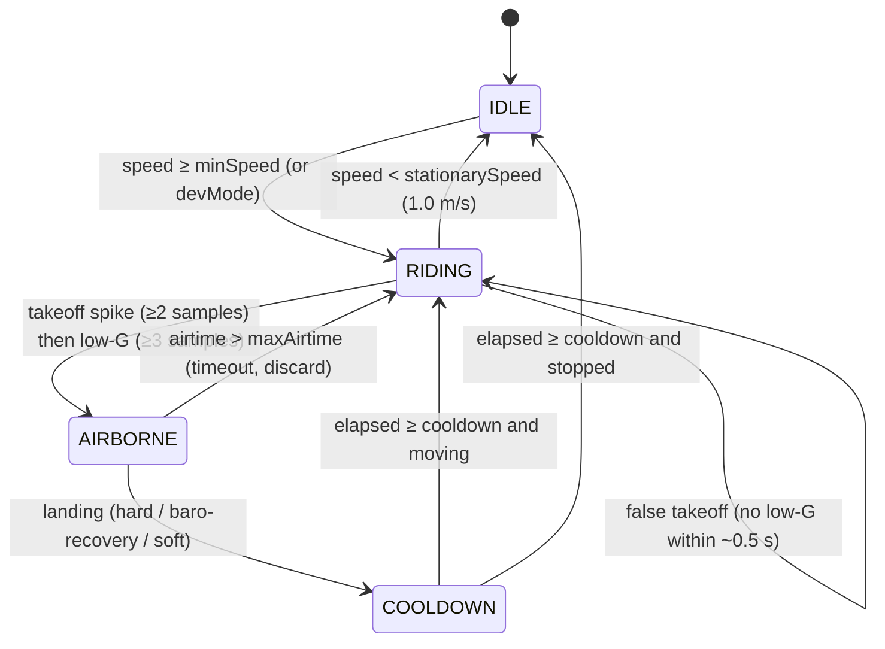

# Jump Detection Algorithm — `jump-detection-swift`

> Single-source summary of the Kiters watchOS jump-detection algorithm, derived from the
> actual Swift implementation and the recorded sensor logs.
>
> **Primary sources**
> - Algorithm: [Kiters Watch App/Services/JumpDetector.swift](../Kiters%20Watch%20App/Services/JumpDetector.swift)
> - Models & config: [Kiters Watch App/Models/Session.swift](../Kiters%20Watch%20App/Models/Session.swift)
> - Sensor capture: [Kiters Watch App/Services/SessionLogger.swift](../Kiters%20Watch%20App/Services/SessionLogger.swift)
> - Offline replay/regression: [Tools/JumpReplay/](../Tools/JumpReplay)
> - Test data: [logs/](../logs)
>
> Values in this document reflect the **code as implemented**, not idealized ranges.

---

## 1. North Star

The Apple Watch is treated as a **noisy wearable sensor platform**. No single sensor is
trusted alone — jump detection and metrics come from sensor fusion:

```
GPS speed + barometer + accelerometer + gravity vector + gyroscope + time continuity
```

Goal: trusted kitesurf session intelligence — fast route tracking, accurate speed, robust
jump detection, believable height, low false positives, and an **explainable** confidence
score. Every detected jump is justifiable from evidence: speed, takeoff spike, low-G,
pressure curve, landing, and confidence.

---

## 2. Sensor Inputs — `IMUSample`

Defined in [Session.swift](../Kiters%20Watch%20App/Models/Session.swift). One sample per sensor tick (~50 Hz active).

| Field | Type | Units | Notes |
|-------|------|-------|-------|
| `timestamp` | `Date` | — | Per-sample time |
| `accelerationX/Y/Z` | `Double` | g | User acceleration (gravity removed) |
| `rotationX/Y/Z` | `Double` | rad/s | Gyroscope angular velocity |
| `gravity` | `Vector3?` | g | World-frame gravity vector (optional) |
| `pressure` | `Double?` | hPa | Barometric pressure (optional, ~1 Hz) |

Derived helpers:

- `accelerationMagnitude = √(ax² + ay² + az²)`
- `rotationMagnitude = √(ωx² + ωy² + ωz²)`

> **Units matter.** Some logs carry raw `m/s²`-style acceleration and degrees/sec gyro
> (Android format); processed logs use g-like user acceleration and rad/s gyro
> (CoreMotion format). The replay `Loader` normalizes these — never copy thresholds
> blindly between logs without checking value ranges.

---

## 3. State Machine

```
IDLE → RIDING → AIRBORNE → COOLDOWN → (RIDING | IDLE)
```

Defined as `enum JumpState` in [JumpDetector.swift](../Kiters%20Watch%20App/Services/JumpDetector.swift).



| State | Responsibility |
|-------|----------------|
| **IDLE** | Wait until GPS speed ≥ `minSpeed`. No jumps while stationary (unless dev/test mode). |
| **RIDING** | Watch for a sustained takeoff spike; maintain pressure baseline. |
| **AIRBORNE** | Track airtime, pressure minimum, apex, gyro rotations, and landing signals. |
| **COOLDOWN** | Block duplicate detection (landing bounce / post-landing hand motion). |

---

## 4. Tunable Parameters & Constants

### `DetectionMode` — 7 user-facing parameters

Two modes: `.standard` (calibrated preset) and `.custom` (UserDefaults-backed). Resolved
through `JumpDetectionConfig.shared` in [Session.swift](../Kiters%20Watch%20App/Models/Session.swift).

| Parameter | Standard default | Units | Meaning |
|-----------|------------------|-------|---------|
| `minSpeed` | `15.0 / 3.6 ≈ 4.17` | m/s (15 km/h) | GPS gate to enter RIDING |
| `takeoffG` | `1.5` | g | Acceleration spike threshold for takeoff |
| `landingG` | `2.0` | g | Impact threshold for hard landing |
| `minAirtime` | `0.5` | s | Minimum airtime to accept a landing |
| `maxAirtime` | `8.0` | s | Timeout — discard if exceeded |
| `cooldown` | `1.5` | s | Pause after landing before next detection |
| `kinematicCalibration` | `1.12` | × | Fallback-height scale factor |

Custom values use UserDefaults keys `jd_*`; standard overrides use `jd_standard_*`.

### Hard-coded constants (JumpDetector)

| Constant | Value | Purpose |
|----------|-------|---------|
| `baroFactor` | `8.3` m/hPa | Pressure → height conversion (sea level) |
| `lowGCeiling` | `0.40` g | Low-G threshold confirming airborne |
| `lowGConfirmSamples` | `3` (~60 ms @ 50 Hz) | Low-G samples needed after takeoff |
| `takeoffConfirmSamples` | `2` (~40 ms @ 50 Hz) | Sustained spike samples for takeoff |
| `stationarySpeed` | `1.0` m/s | Stationary threshold |
| `pressureMedianSize` | `7` | Median window for pressure filter |

---

## 5. Pressure Filtering Pipeline

Cheap, three-stage filter applied **only when a new raw pressure value arrives** (~1 Hz) —
avoids biasing the IIR stages with replicated 50 Hz reads.

```
raw pressure (hPa)
  → median window (size 7)        // strips single-sample impact/vibration spikes
  → IIR low-pass  α₁ = 0.30       // LP1 = 0.30·median + 0.70·LP1_prev
  → IIR low-pass  α₂ = 0.15       // LP2 = 0.15·LP1   + 0.85·LP2_prev → filteredPressure
```

- **Baseline** tracked as EMA `α = 0.07` over the smoothed signal:
  `baselinePressure = 0.93·prev + 0.07·filtered`. Updated only in IDLE/RIDING.
- **`minPressure`** tracked **only while AIRBORNE** (the apex of the pressure dip).

---

## 6. Height Estimation

### 6.1 Barometric height (primary)

```
h_baro = (baselinePressure − minPressure) × 8.3   [metres]
```

Used when a barometer is present **and** `h_baro > 0.2 m`.

### 6.2 Kinematic height (fallback)

When no barometer / unreliable baro:

```
h_kin = kinematicCalibration × g × airtime² / 8
      = 1.12 × 9.81 × t² / 8        [metres]
```

The `1.12` factor compensates for the ~12% underestimation of asymmetric kite-jump arcs
(boosted takeoff + weighted landing) versus a symmetric ballistic assumption.

### 6.3 Selection & clamp

```swift
height = (hasBaro && h_baro > 0.2) ? h_baro : h_kin
clampedHeight = max(0.3, min(25.0, height))   // 0.3 m … 25 m
```

The chosen source is reported per jump as `heightSource: baro | kinematic`.

---

## 7. Distance, Vertical Acceleration & Rotations

### 7.1 Jump distance

```
jumpDistance = min(150, takeoffSpeed × airtime)   [metres]
```

`takeoffSpeed` is GPS speed captured at the confirmed takeoff spike; 150 m is a safety cap.

### 7.2 World-frame vertical acceleration

Robust to wrist rotation — projects user acceleration onto the gravity unit vector:

```
gMag = √(gx² + gy² + gz²)
dot  = (ax·gx + ay·gy + az·gz) / gMag
verticalAccelG = |dot + gMag|
```

Interpretation: at rest ≈ `1.0 g`; free-fall / airborne low-load ≈ `0.0 g`; hard landing
`> 1.0 g`. Falls back to `accelerationMagnitude` when no gravity vector is available.

### 7.3 Rotation counting

Integrate gyro magnitude across airborne samples:

```
totalRad += rotationMagnitude × dt      // per consecutive sample pair
rotations = Int(totalRad / 2π)
```

Captures spins (yaw), flips (pitch), and barrel rolls (roll). Inputs are rad/s — Android
logs in deg/s are converted to rad/s by the replay loader before integration.

---

## 8. Landing Detection

Evaluated each airborne sample; **any** of the first three conditions finalizes the jump,
the fourth discards it.

| # | Mode | Condition |
|---|------|-----------|
| A | **Hard landing** | `accel ≥ landingG (2.0)` **and** `airtime ≥ minAirtime (0.5 s)` |
| B | **Baro recovery** | `airtime ≥ minAirtime`, baro present, and `filteredPressure ≥ baseline − max(drop × 0.08, 0.03 hPa)` |
| C | **Soft landing** | `airtime ≥ minAirtime` and 6 of last 8 samples satisfy `|verticalAccelG − 1.0| < 0.3` |
| D | **Timeout** | `airtime > maxAirtime (8.0 s)` → discard (likely sensor malfunction) |

Mode B handles glide/soft landings without an impact spike; Mode C uses the world-frame
vertical projection so it is robust to mid-jump watch rotation.

---

## 9. Confidence Scoring

Start at `50`, adjust by evidence, clamp to `0…100`. **Accept the jump when `confidence ≥ 50`.**

| Event | Δ | Condition |
|-------|---|-----------|
| Start | `+50` | baseline |
| Baro confirms height | `+20` | `hasBaro && baroHeight > 0.3 m` |
| Clean takeoff (strong) | `+15` | `peakTakeoff ≥ 1.3 × takeoffG` |
| Clean takeoff (normal) | `+8` | `peakTakeoff ≥ takeoffG` |
| Ride-away after landing | `+10` | `speed ≥ 2.0 m/s` (`stationarySpeed × 2`) |
| Good airtime | `+5` | `airtime ≥ 1.0 s` |
| Stationary takeoff | `−20` | `takeoffSpeed < 1.0 m/s` (skipped in dev mode) |
| Chaotic gyro (toss) | `−15` | `avgGyro > 8.0` **and** `maxGyro > 15.0` (skipped in dev mode) |
| Clamp | — | `max(0, min(100, conf))` |

The `−20` / `−15` penalties are the main guards against false jumps from hand waves and
watch tosses (high accel but no clean pressure curve, often stationary or chaotic gyro).

---

## 10. Per-Jump Output — `Jump`

Defined in [Session.swift](../Kiters%20Watch%20App/Models/Session.swift).

| Field | Type | Description |
|-------|------|-------------|
| `id` | `String` | UUID |
| `sessionId` | `String` | Owning session |
| `startTime` | `Date` | Confirmed takeoff time |
| `endTime` | `Date` | Landing time |
| `height` | `Double` | Metres (baro-primary, kinematic fallback) |
| `airtime` | `Double` | Seconds |
| `jumpDistance` | `Double` | Metres (`takeoffSpeed × airtime`) |
| `rotations` | `Int` | Full 2π rotations |
| `confidence` | `Double` | 0–100 (accept ≥ 50) |
| `imuSamples` | `[IMUSample]` | All samples from takeoff → landing |
| `apexTime` | `Double?` | Seconds from takeoff to apex |

---

## 11. Sensor Logs (`logs/`)

On-device captures and synthetic/replayable datasets used for calibration and regression.

| File | Format | Approx. samples / duration / rate | Purpose |
|------|--------|-----------------------------------|---------|
| `kitesurf_session_5min_3jumps.json` | Android JSON | ~15,000 / 300 s / ~50 Hz | Normal session, 3 real jumps |
| `kitesurf_session_5min_3jumps.original.json` | Android JSON | ~3,000 / 300 s / ~10 Hz | Lower-rate raw `m/s²` variant — do not copy thresholds blindly |
| `kitesurf_ultra_realistic_log.json` | Android JSON | ~700 / ~14 s / ~50 Hz | Ultra-realistic short session |
| `kitesurf_ultra_realistic_log.csv` | CSV | ~700 / ~14 s / ~50 Hz | CSV equivalent of the above |
| `kitesurf_extreme_failure_case_log.json` | Android JSON | ~900 / ~18 s / ~50 Hz | False-positive rejection test (high accel, chaotic gyro) |
| `kitesurf_realistic_log.csv` | CSV (Android) | realistic noisy session | gyro in deg/s; gravity in g-units |
| `kitesurf_jump_log_synthetic.csv` | CSV (CoreMotion) | synthetic | Baseline synthetic test |
| `log_ondevice_synthetic.csv` | CSV (on-device) | synthetic | On-device logger shape |

### CSV column schema (raw log files)

```
timestamp, accX, accY, accZ, gravX, gravY, gravZ, baro, gyrX, gyrY, gyrZ
```

- **Acceleration:** `m/s²` (CoreMotion) or linear/user `m/s²` (Android)
- **Gravity:** ~9.8 `m/s²` (CoreMotion) or ~1.0 g-units (Android)
- **Gyro:** rad/s (CoreMotion) or deg/s (Android → converted by loader)
- **Timestamps:** Unix seconds (float) or ISO8601 strings

### On-device `SessionLogger` CSV (20 columns, self-documenting header)

```
idx, t, ax, ay, az, aM, gx, gy, gz, gM, gvX, gvY, gvZ, baro, baseBaro, spd, lowG, state, evt
```

Includes algorithm internals (`lowG` count, `state` string, `evt` annotation) and a metadata
header with session ID, detection mode, and the 6 algorithm parameters. Writes are async on
a serial queue (never blocks the sensor thread), flushed every 250 samples (~5 s @ 50 Hz).

---

## 12. Replay & Regression Tooling — `Tools/JumpReplay`

Offline CLI that feeds a log through the **same** `JumpDetector` used on-watch (via symlinked
sources), so tuning is reproducible without a device.

**Flow:** load CSV/JSON → auto-detect format → `IMUSample[]` → `MockGPS` constant-speed ticks →
`JumpDetector.processSample()` → `ReplayReport` JSON + human summary.

Key flags: `--mode <standard|custom>`, `--speed <m/s>`, `--bless` (write baselines),
`--compare` (fail on mismatch), `-v` (sample-level events).

**`ReplayReport` per-jump fields:** `index`, `takeoffOffsetSec`, `airtime`, `height`,
`heightSource`, `apexTime`, `confidence`, `rotations`, `jumpDistance`, `accepted`.

**Regression baselines** live in `Tools/JumpReplay/expected/`. Run via the workspace tasks:

- `Verify JumpDetector` → `./verify.sh`
- `Bless JumpDetector Baselines` → `./verify.sh --bless`
- `Verify JumpDetector (verbose)` → `./verify.sh --verbose`

`Reporter.compare()` tolerances: jump count exact; airtime ±0.2 s; height ±15%; apex ±0.3 s;
acceptance flag must match.

---

## 13. Calibration Workflow (when given new logs)

1. Identify sample rate: `sampleRate = sampleCount / durationSeconds`.
2. Profile units & distributions: accel median/max, gyro median/max, speed min/avg/max,
   pressure min/max/range.
3. Segment candidate jumps: sustained accel spike → low-G window → pressure drop → recovery →
   landing.
4. Compare detected vs expected jump count.
5. Tune **one or two** thresholds at a time.
6. Re-run the same logs after every change (`verify.sh`).
7. Keep distinct logs for: normal jumps, realistic noise, extreme failure case, and
   stationary/hand-movement/watch-toss.

---

## 14. Editing Rules

1. Preserve the state machine unless there is a clear reason to refactor.
2. Keep sensor processing efficient: no heavy allocations or array sorts per 50 Hz sample.
3. Keep pressure filtering cheap (barometer updates slowly).
4. Never block the main thread; keep GPS updates thread-safe.
5. Log around state transitions and jump finalization.
6. Make every threshold configurable via `DetectionMode` / `JumpDetectionConfig`.
7. Never "fix" false positives by making thresholds unrealistically strict without testing
   against real jump logs. Do not overfit to a single log.

### Do not

- Detect jumps from acceleration magnitude alone.
- Treat every pressure drop as a jump.
- Update baseline pressure while airborne.
- Ignore GPS speed in production detection.
- Ignore hand-movement / watch-toss false positives.
- Assume gyro units without checking.
- Run large on-watch ML models for real-time detection before the deterministic logic is stable.
