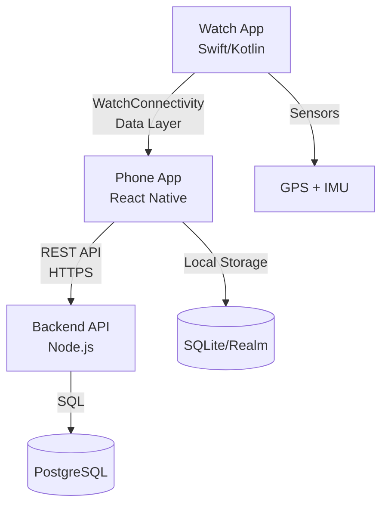

# 00 - Product Overview

## Product Scope

**SPOTEQ** is a cross-platform wind sports tracking system designed for kiteboarding, windsurfing, wingfoiling, and surfing. The system provides real-time session tracking with advanced jump detection, speed metrics, and GPS route mapping.

### Supported Sports
- **Kiteboarding** (primary focus)
- **Windsurfing**
- **Wingfoiling**
- **Surfing** (wave detection instead of jumps)

## Core Features (MVP)

### Watch Application
1. **Session Tracking**
   - Start/stop/pause session controls
   - Real-time speed display (current, max, average)
   - Session duration timer
   - Distance covered

2. **Jump Detection**
   - Automatic jump detection using IMU sensors
   - Airtime calculation (milliseconds precision)
   - Jump height estimation
   - Jump count per session

3. **Data Collection**
   - GPS track at 1Hz (optimized for battery)
   - IMU sampling at 50Hz during motion
   - Event timestamping
   - Battery-efficient background recording

4. **Offline Operation**
   - Full session recording without phone connection
   - Local storage on watch
   - Post-session sync to phone

### Mobile Application (React Native)
1. **Live Session View**
   - Real-time metrics from watch (when connected)
   - Current speed, session time
   - Jump counter
   - Simple map view

2. **Session History**
   - List of all recorded sessions
   - Quick stats: duration, distance, max speed, jump count
   - Sort and filter by date/sport

3. **Session Details**
   - Full route map with GPS track
   - Jump timeline with details (height, airtime)
   - Speed graph over time
   - Session summary statistics
   - Share session (future)

4. **Offline-First Architecture**
   - All sessions stored locally
   - Background sync when online
   - Conflict resolution
   - Upload queue with retry logic

### Backend API (Node.js)
1. **User Management**
   - Registration and authentication (JWT)
   - Profile management
   - Password reset

2. **Session Storage**
   - Upload/download sessions
   - Session metadata indexing
   - Bulk data compression

3. **Analytics** (Future)
   - Personal best tracking
   - Progress over time
   - Leaderboards (optional, v2)

## Product Differentiators

### vs. Surfr/WOO
- **Open Source**: Full control over your data
- **Cross-Platform**: Works with both Apple Watch and Wear OS
- **Privacy-First**: Self-hostable backend option
- **Offline-First**: Complete functionality without internet
- **Extensible**: Algorithm improvements and custom sports modes

## Data Ownership & Privacy

### Principles
1. **User Owns Their Data**
   - Sessions stored locally first
   - Optional cloud sync
   - Export functionality (GPX, JSON)
   - Account deletion removes all data

2. **Minimal Data Collection**
   - No location tracking outside sessions
   - No analytics without consent
   - No third-party data sharing
   - Open data formats

3. **Encryption**
   - HTTPS for all API communication
   - Encrypted storage on device
   - Hashed passwords (bcrypt)
   - Optional end-to-end session encryption

### GDPR Compliance
- Right to access (export all data)
- Right to erasure (delete account)
- Data minimization
- Consent-based processing
- Privacy policy in app

## Offline-First Model

### Design Philosophy
The app must work **completely offline**. Cloud sync is a convenience feature, not a requirement.

### Storage Strategy
```
Watch (primary recording)
  ↓ (WatchConnectivity / Data Layer)
Phone (local database)
  ↓ (background sync when online)
Backend (optional backup/sync)
```

### Sync Behavior
1. **Watch → Phone**: Immediate transfer when in range
2. **Phone → Backend**: Background sync when WiFi available
3. **Conflict Resolution**: Last-write-wins with timestamp
4. **Offline Queue**: Failed uploads retry automatically

## Technical Architecture (High-Level)



### Technology Stack
- **watchOS**: Swift, SwiftUI, CoreMotion, CoreLocation
- **Wear OS**: Kotlin, Jetpack Compose, Sensors API
- **Mobile**: React Native, TypeScript, Realm/WatermelonDB
- **Backend**: Node.js, NestJS, PostgreSQL, Docker
- **Communication**: REST API, JSON, optional Protocol Buffers

## Performance Targets

### Battery Life
- **Watch**: 3-4 hours continuous tracking
- **Phone**: Minimal battery impact when watch is doing the work
- **Strategy**: Adaptive sampling rates, motion-triggered IMU

### Accuracy
- **Speed**: ±0.5 km/h (GPS dependent)
- **Jump Height**: ±0.5m (algorithm dependent)
- **Airtime**: ±50ms
- **GPS Track**: 1-5m accuracy (device dependent)

### Responsiveness
- **Watch UI**: < 16ms frame time (60fps)
- **Jump Detection**: < 500ms latency
- **Phone Sync**: < 5s for metadata, background for bulk data
- **API Response**: < 200ms (p95)

## MVP Feature Priorities

### Phase 1 (MVP - 3 months)
✅ **Must Have**
- [ ] watchOS app with basic session recording
- [ ] GPS tracking and speed calculation
- [ ] Simple jump detection (threshold-based)
- [ ] React Native app with session list
- [ ] Session detail view with map
- [ ] Local storage on phone
- [ ] Basic backend API (auth + session CRUD)

❌ **Explicitly Out of Scope**
- Wear OS app (Phase 2)
- Advanced jump algorithm
- Live session view on phone
- Social features
- Leaderboards
- 3D replay

### Phase 2 (v1.0 - 2 months)
- [ ] Wear OS app
- [ ] Improved jump detection algorithm
- [ ] Live session view on phone
- [ ] Session export (GPX)
- [ ] Backend sync with conflict resolution

### Phase 3 (v2.0 - Future)
- [ ] Leaderboards
- [ ] Social sharing
- [ ] 3D jump visualization
- [ ] Coaching insights
- [ ] Weather integration
- [ ] Multi-session analytics

## Success Metrics

### Technical
- Session recording success rate > 99%
- Jump detection recall > 85% (vs manual count)
- Jump detection precision > 90% (minimize false positives)
- Sync success rate > 95%
- App crash rate < 0.1%

### User Experience
- Time to start session < 5 seconds
- Post-session view available < 10 seconds after stop
- Intuitive UI (usable while riding with gloves/water on screen)

## Development Checklist

### Pre-Development
- [ ] Review all 13 documentation files
- [ ] Set up development environment (Xcode, Android Studio, Node.js)
- [ ] Create GitHub repository (monorepo structure)
- [ ] Set up project management (issues, milestones)

### MVP Readiness
- [ ] Apple Watch hardware available for testing
- [ ] iPhone for development
- [ ] Access to water sports location for field testing
- [ ] Beta testers identified

### Compliance
- [ ] Privacy policy drafted
- [ ] Terms of service drafted
- [ ] App Store / Play Store accounts ready
- [ ] GDPR compliance reviewed (if targeting EU users)

---

**Next Steps**: Review the architecture document (`01_architecture.md`) to understand the system design and data flow.
