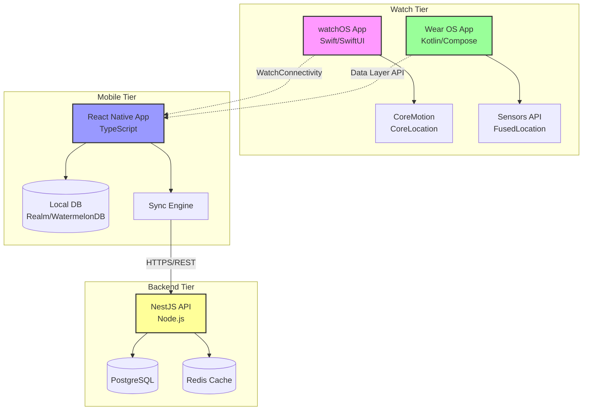
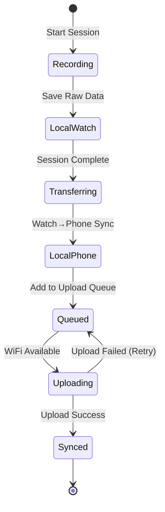
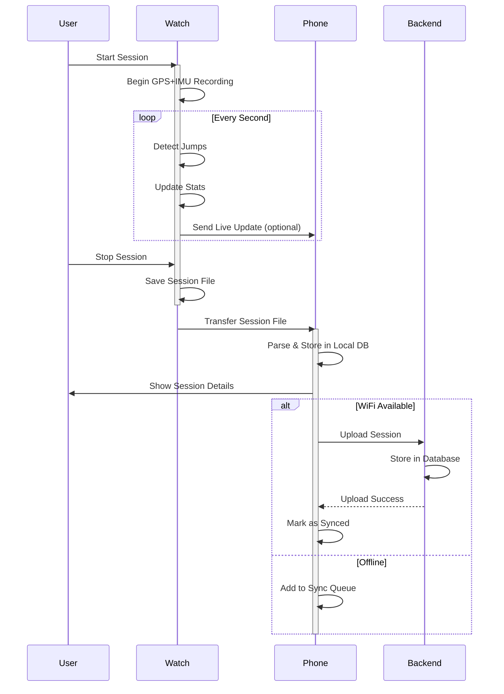
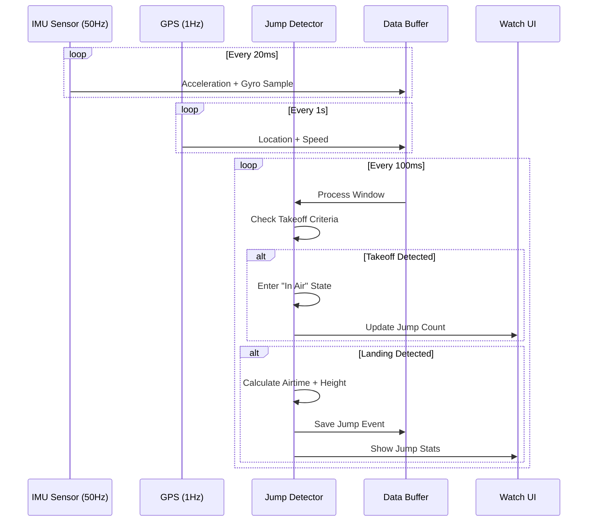
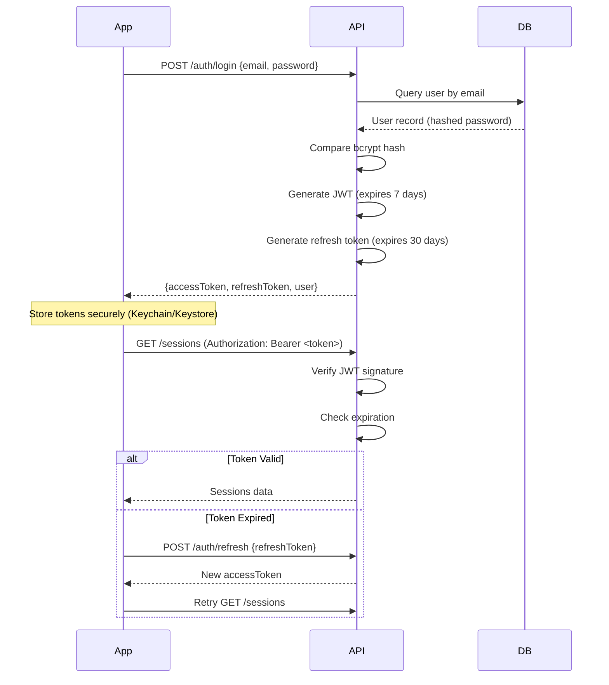

# 01 - System Architecture

## Architecture Overview

SPOTEQ follows a **three-tier architecture** with offline-first principles:

1. **Watch Layer** (Data Collection): Native watch apps record sensor data
2. **Mobile Layer** (Data Management): React Native app manages, displays, and syncs data
3. **Backend Layer** (Cloud Sync): Node.js API provides backup and multi-device sync

## System Diagram



## Component Responsibilities

### Watch Apps (watchOS & Wear OS)

**Primary Role**: Sensor data collection and real-time session tracking

**Responsibilities**:
- Start/stop/pause session control
- High-frequency sensor sampling (IMU: 50Hz, GPS: 1Hz)
- Real-time jump detection
- On-device data buffering
- Basic UI for session control and live metrics
- Battery-optimized background processing
- Transfer completed sessions to phone

**Data Flow**:
```
Sensors → Buffer (memory) → Jump Detection → Local Storage → Transfer to Phone
```

**Storage**:
- In-memory circular buffer (last 5 minutes of raw data)
- Persistent storage for current session (SQLite or file-based)
- Completed sessions as compressed JSON files

### Mobile App (React Native)

**Primary Role**: User interface, data management, and sync orchestration

**Responsibilities**:
- Receive sessions from watch
- Store all sessions in local database
- Display session analytics and maps
- Manage user account
- Orchestrate background sync with backend
- Handle offline queue and conflict resolution
- Export sessions (GPX, JSON)

**Data Flow**:
```
Watch → Message Handler → Parser → Local DB → UI
Local DB → Sync Queue → API Client → Backend
Backend → API Client → Local DB → UI
```

**Storage**:
- Realm or WatermelonDB for structured session data
- File system for large GPS tracks (chunked)
- Sync queue table for pending uploads

### Backend API (Node.js)

**Primary Role**: Multi-device sync, backup, and optional social features

**Responsibilities**:
- User authentication (JWT)
- Session CRUD operations
- Bulk upload/download
- Session metadata indexing
- Optional leaderboards (future)
- Data analytics (future)

**Data Flow**:
```
API Endpoint → Validation → Business Logic → Database → Response
```

**Storage**:
- PostgreSQL for structured data (users, session metadata)
- S3-compatible storage for bulk GPS/IMU data (future optimization)
- Redis for session caching and rate limiting

## Communication Protocols

### Watch ↔ Phone

#### watchOS (WatchConnectivity Framework)

**Live Session Updates** (while session active):
```swift
// Interactive messaging (requires phone app active)
let message = [
    "type": "live_update",
    "speed": 25.3,
    "jumpCount": 5,
    "sessionId": "uuid"
]
session.sendMessage(message, replyHandler: nil)
```

**Session Transfer** (after session completes):
```swift
// File transfer (works in background)
let fileURL = getSessionFileURL()
session.transferFile(fileURL, metadata: [
    "sessionId": "uuid",
    "timestamp": Date().timeIntervalSince1970
])
```

**Application Context** (persistent state):
```swift
// For small data that should persist
try session.updateApplicationContext([
    "lastSessionId": "uuid",
    "totalSessions": 42
])
```

#### Wear OS (Data Layer API)

**Live Session Updates**:
```kotlin
// MessageClient for real-time messages
Wearable.getMessageClient(context).sendMessage(
    nodeId,
    "/live_update",
    message.toByteArray()
)
```

**Session Transfer**:
```kotlin
// DataClient for synced data
val putDataReq = PutDataMapRequest.create("/session").apply {
    dataMap.putString("sessionId", sessionId)
    dataMap.putByteArray("data", compressedSession)
    dataMap.putLong("timestamp", System.currentTimeMillis())
}.asPutDataRequest()

Wearable.getDataClient(context).putDataItem(putDataReq)
```

### Phone ↔ Backend

**Protocol**: REST API over HTTPS with JWT authentication

**Endpoints**:
```
POST   /auth/register
POST   /auth/login
POST   /auth/refresh
GET    /users/me
PUT    /users/me

GET    /sessions
GET    /sessions/:id
POST   /sessions
PUT    /sessions/:id
DELETE /sessions/:id

POST   /sessions/:id/data/upload
GET    /sessions/:id/data/download
```

**Request Format**:
```typescript
// Session upload
POST /sessions
Headers: {
  Authorization: Bearer <jwt_token>
  Content-Type: application/json
}
Body: {
  sessionId: "uuid",
  sport: "kiteboarding",
  startTime: "2026-02-22T10:00:00Z",
  endTime: "2026-02-22T12:30:00Z",
  summary: {
    distance: 25.3,
    maxSpeed: 42.5,
    avgSpeed: 18.2,
    jumpCount: 15
  },
  jumps: [...],
  gpsTrack: [...] // or reference to uploaded blob
}
```

## Data Sync Strategy

### Offline-First Principles

1. **Watch is Source of Truth** during session
2. **Phone is Primary Storage** after sync
3. **Backend is Backup/Multi-Device Sync**

### Sync States



### Conflict Resolution

**Strategy**: Last-Write-Wins with Timestamp

**Scenario**: Session edited on phone while offline, then downloaded from backend

```typescript
interface SyncConflict {
  localVersion: Session;
  remoteVersion: Session;
  localTimestamp: number;
  remoteTimestamp: number;
}

function resolveConflict(conflict: SyncConflict): Session {
  // Simple: newest wins
  if (conflict.localTimestamp > conflict.remoteTimestamp) {
    return conflict.localVersion;
  }
  return conflict.remoteVersion;
}
```

**Future Enhancement**: Three-way merge with conflict UI

### Sync Queue Design

```typescript
interface SyncQueueItem {
  id: string;
  sessionId: string;
  operation: 'upload' | 'download' | 'delete';
  priority: number; // Higher = more important
  retryCount: number;
  maxRetries: number;
  createdAt: Date;
  lastAttempt?: Date;
  error?: string;
}
```

**Queue Processing**:
1. Process on WiFi connection (or user override)
2. Process by priority (newest sessions first)
3. Exponential backoff on failures
4. Mark as failed after max retries (user notification)

## Event Flow Diagrams

### Complete Session Flow



### Jump Detection Flow (Real-Time)



## Scalability Considerations

### Watch App
- **Limitation**: Battery and memory constraints
- **Strategy**: Adaptive sampling (reduce GPS frequency when not moving)
- **Max Session**: 6 hours continuous recording

### Mobile App
- **Limitation**: Storage on device
- **Strategy**: Auto-archive old sessions (delete raw data, keep summary)
- **Target**: 500 sessions with full data, unlimited with summaries

### Backend
- **Limitation**: Database size and query performance
- **Strategy**:
  - Partition sessions by user + date
  - Move old GPS tracks to cold storage (S3)
  - Redis caching for recent sessions
- **Target**: 100K users, 10M sessions

## Security Architecture

### Authentication Flow



### Data Encryption

**In Transit**:
- HTTPS with TLS 1.3
- Certificate pinning (future enhancement)

**At Rest**:
- Phone: iOS/Android keychain for tokens, encrypted database
- Backend: Encrypted PostgreSQL (transparent data encryption)
- Watch: iOS/Android secure storage

## Performance Optimization

### Watch App
- Use background tasks efficiently (WorkoutSession API)
- Batch writes to disk (every 5 seconds)
- Compress GPS tracks (Douglas-Peucker algorithm)

### Mobile App
- Lazy load session details
- Virtualized lists for sessions
- Memoize expensive calculations
- Offline images with progressive loading

### Backend
- Database indexing on user_id, timestamp
- API response compression (gzip)
- Rate limiting per user
- Connection pooling

## Development Checklist

### Architecture Setup
- [ ] Create monorepo structure
- [ ] Set up shared TypeScript types
- [ ] Document API contract (OpenAPI/Swagger)
- [ ] Design database schema
- [ ] Create sequence diagrams for critical flows

### Watch ↔ Phone Communication
- [ ] Implement WatchConnectivity delegate (iOS)
- [ ] Implement Data Layer listeners (Android)
- [ ] Test file transfer with large sessions
- [ ] Handle disconnection/reconnection gracefully

### Phone ↔ Backend Sync
- [ ] Implement sync queue with retry logic
- [ ] Add conflict resolution
- [ ] Test offline→online transitions
- [ ] Monitor sync success rate

### Security
- [ ] Implement JWT authentication
- [ ] Add refresh token rotation
- [ ] Set up HTTPS certificates
- [ ] Review data access controls

---

**Next Steps**: Review the repository structure (`02_repo_structure.md`) to set up your development environment.
