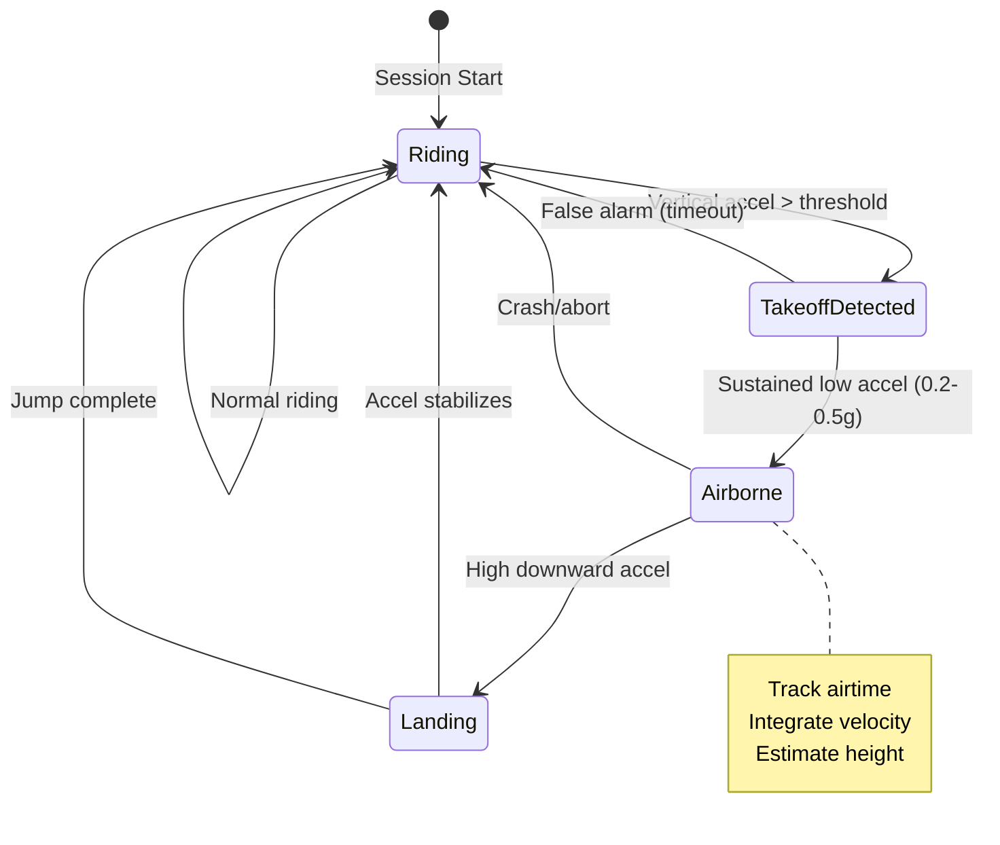

# 05 - Jump Detection Algorithm

## Overview

The jump detection algorithm is the **most critical component** of SPOTEQ. It must accurately detect jumps in challenging conditions: water spray, vibrations, board chop, and varying jump styles (boosted vs. unhooked, rotations, etc.).

## Algorithm Design Philosophy

### Key Principles

1. **Multi-Sensor Fusion**: Combine IMU (accelerometer + gyroscope) with GPS for robustness
2. **State Machine**: Track jump phases (on-water → takeoff → airborne → landing → on-water)
3. **Adaptive Thresholds**: Adjust sensitivity based on conditions and user calibration
4. **False Positive Reduction**: Aggressively filter choppy water, crashes, and hand gestures
5. **Confidence Scoring**: Each jump gets a confidence score (0-100%)

### Challenges in Water Sports

| Challenge | Impact | Mitigation Strategy |
|-----------|--------|---------------------|
| **Choppy Water** | False takeoffs from waves | Require sustained acceleration change |
| **Vibrations** | Noisy accelerometer data | Low-pass filtering + moving average |
| **Hand Movements** | False jumps from watch gestures | Require GPS speed threshold |
| **Board Rotations** | Confusing orientation changes | Use vertical acceleration primarily |
| **Crashes** | Look like landings | Check for abnormal impact patterns |
| **Water Spray** | None (IMU sealed) | N/A |

## State Machine



## Core Algorithm (TypeScript Reference)

This TypeScript implementation serves as the reference for Swift and Kotlin ports.

### Data Structures

```typescript
// packages/jump-detection/src/types.ts

export interface IMUSample {
  timestamp: Date;
  accelerationX: number;  // m/s² (user acceleration, gravity removed)
  accelerationY: number;
  accelerationZ: number;  // Vertical (watch face up)
  rotationX: number;      // rad/s
  rotationY: number;
  rotationZ: number;
  pitch: number;          // rad
  roll: number;
  yaw: number;
}

export interface Jump {
  id: string;
  startTime: Date;
  endTime: Date;
  airtime: number;        // seconds
  height: number;         // meters
  maxVerticalVelocity: number;  // m/s
  confidence: number;     // 0-100
  takeoffSpeed: number;   // m/s (from GPS)
  landingSpeed: number;   // m/s
  rotationDetected: boolean;
  rawData?: IMUSample[];  // Optional: store raw IMU during jump
}

export enum JumpState {
  Riding = 'riding',
  TakeoffDetected = 'takeoff_detected',
  Airborne = 'airborne',
  Landing = 'landing'
}
```

### Main Detector Class

```typescript
// packages/jump-detection/src/detector.ts

import { IMUSample, Jump, JumpState } from './types';
import { LowPassFilter } from './filters';
import { HeightEstimator } from './heightEstimator';

export class JumpDetector {
  private state: JumpState = JumpState.Riding;
  private currentJump: Partial<Jump> | null = null;
  private detectedJumps: Jump[] = [];
  
  // Filters
  private accelFilter = new LowPassFilter(0.3); // 30% smoothing
  
  // Buffers
  private sampleBuffer: IMUSample[] = [];
  private readonly BUFFER_SIZE = 250; // 5 seconds at 50Hz
  
  // State tracking
  private takeoffTime: Date | null = null;
  private airtimeStart: Date | null = null;
  private verticalVelocity = 0;
  private maxVerticalVelocity = 0;
  
  // Thresholds (tunable)
  private readonly TAKEOFF_ACCEL_THRESHOLD = 1.5;  // g (in addition to gravity)
  private readonly AIRBORNE_ACCEL_MIN = 0.2;        // g (free fall detection)
  private readonly AIRBORNE_ACCEL_MAX = 0.5;        // g (still mostly free fall)
  private readonly LANDING_ACCEL_THRESHOLD = 2.0;   // g (impact)
  private readonly MIN_AIRTIME = 0.3;               // seconds (filter tiny hops)
  private readonly MIN_SPEED = 5.0;                 // m/s (must be moving)
  private readonly TAKEOFF_WINDOW = 2.0;            // seconds (max time to confirm takeoff)
  
  private currentSpeed = 0; // From GPS, updated externally
  
  public processSample(sample: IMUSample): void {
    // Add to buffer
    this.sampleBuffer.push(sample);
    if (this.sampleBuffer.length > this.BUFFER_SIZE) {
      this.sampleBuffer.shift();
    }
    
    // Filter acceleration
    const filteredAccel = this.accelFilter.filter(sample.accelerationZ);
    
    // State machine
    switch (this.state) {
      case JumpState.Riding:
        this.checkForTakeoff(sample, filteredAccel);
        break;
        
      case JumpState.TakeoffDetected:
        this.confirmTakeoff(sample, filteredAccel);
        break;
        
      case JumpState.Airborne:
        this.trackAirborne(sample, filteredAccel);
        break;
        
      case JumpState.Landing:
        this.finalizeLanding(sample);
        break;
    }
  }
  
  private checkForTakeoff(sample: IMUSample, accel: number): void {
    // Require minimum speed (filter hand gestures while stationary)
    if (this.currentSpeed < this.MIN_SPEED) return;
    
    // Check for sudden upward acceleration
    if (accel > this.TAKEOFF_ACCEL_THRESHOLD) {
      this.state = JumpState.TakeoffDetected;
      this.takeoffTime = sample.timestamp;
      this.currentJump = {
        id: this.generateJumpId(),
        startTime: sample.timestamp,
        takeoffSpeed: this.currentSpeed,
        rawData: []
      };
    }
  }
  
  private confirmTakeoff(sample: IMUSample, accel: number): void {
    const elapsed = this.elapsedSince(this.takeoffTime);
    
    // Check for free fall (confirms we're airborne)
    const absAccel = Math.abs(accel);
    
    if (absAccel >= this.AIRBORNE_ACCEL_MIN && absAccel <= this.AIRBORNE_ACCEL_MAX) {
      // Confirmed airborne!
      this.state = JumpState.Airborne;
      this.airtimeStart = sample.timestamp;
      this.verticalVelocity = 0;
      this.maxVerticalVelocity = 0;
      this.currentJump!.rawData!.push(sample);
      
    } else if (elapsed > this.TAKEOFF_WINDOW) {
      // False alarm - timeout
      this.resetToRiding();
    }
  }
  
  private trackAirborne(sample: IMUSample, accel: number): void {
    // Save IMU data during jump
    this.currentJump!.rawData!.push(sample);
    
    // Integrate acceleration to get velocity
    const dt = 0.02; // 50Hz = 20ms
    this.verticalVelocity += accel * 9.81 * dt; // Convert g to m/s²
    this.maxVerticalVelocity = Math.max(this.maxVerticalVelocity, this.verticalVelocity);
    
    // Check for landing (high downward acceleration)
    if (accel < -this.LANDING_ACCEL_THRESHOLD) {
      this.state = JumpState.Landing;
      this.currentJump!.endTime = sample.timestamp;
    }
    
    // Safety: max airtime 30 seconds (something went wrong)
    if (this.elapsedSince(this.airtimeStart) > 30) {
      this.resetToRiding();
    }
  }
  
  private finalizeLanding(sample: IMUSample): void {
    const airtime = this.elapsedSince(this.airtimeStart);
    
    // Filter too-short jumps
    if (airtime < this.MIN_AIRTIME) {
      this.resetToRiding();
      return;
    }
    
    // Estimate height
    const estimator = new HeightEstimator();
    const height = estimator.estimateHeight({
      airtime,
      maxVerticalVelocity: this.maxVerticalVelocity,
      takeoffSpeed: this.currentJump!.takeoffSpeed!
    });
    
    // Calculate confidence
    const confidence = this.calculateConfidence(airtime, height);
    
    // Finalize jump
    const jump: Jump = {
      id: this.currentJump!.id!,
      startTime: this.currentJump!.startTime!,
      endTime: this.currentJump!.endTime!,
      airtime,
      height,
      maxVerticalVelocity: this.maxVerticalVelocity,
      confidence,
      takeoffSpeed: this.currentJump!.takeoffSpeed!,
      landingSpeed: this.currentSpeed,
      rotationDetected: this.detectRotation(this.currentJump!.rawData!),
      rawData: this.currentJump!.rawData
    };
    
    this.detectedJumps.push(jump);
    this.resetToRiding();
    
    // Callback for real-time notification
    this.onJumpDetected?.(jump);
  }
  
  private calculateConfidence(airtime: number, height: number): number {
    let confidence = 100;
    
    // Penalize very short airtime
    if (airtime < 0.5) confidence -= 30;
    else if (airtime < 0.7) confidence -= 15;
    
    // Penalize very low height
    if (height < 0.5) confidence -= 20;
    else if (height < 1.0) confidence -= 10;
    
    // Bonus for longer jumps
    if (airtime > 2.0) confidence = Math.min(100, confidence + 10);
    if (height > 5.0) confidence = Math.min(100, confidence + 10);
    
    return Math.max(0, confidence);
  }
  
  private detectRotation(samples: IMUSample[]): boolean {
    // Check for sustained rotation in any axis
    const rotationThreshold = 3.0; // rad/s
    const sustainedSamples = 10; // ~200ms
    
    let count = 0;
    for (const sample of samples) {
      const maxRotation = Math.max(
        Math.abs(sample.rotationX),
        Math.abs(sample.rotationY),
        Math.abs(sample.rotationZ)
      );
      if (maxRotation > rotationThreshold) count++;
      else count = 0;
      
      if (count >= sustainedSamples) return true;
    }
    return false;
  }
  
  private resetToRiding(): void {
    this.state = JumpState.Riding;
    this.currentJump = null;
    this.takeoffTime = null;
    this.airtimeStart = null;
    this.verticalVelocity = 0;
    this.maxVerticalVelocity = 0;
  }
  
  private elapsedSince(time: Date | null): number {
    if (!time) return 0;
    return (Date.now() - time.getTime()) / 1000;
  }
  
  private generateJumpId(): string {
    return `jump_${Date.now()}_${Math.random().toString(36).substr(2, 9)}`;
  }
  
  // Public API
  public updateSpeed(speed: number): void {
    this.currentSpeed = speed;
  }
  
  public getDetectedJumps(): Jump[] {
    return [...this.detectedJumps];
  }
  
  public reset(): void {
    this.detectedJumps = [];
    this.resetToRiding();
  }
  
  public onJumpDetected?: (jump: Jump) => void;
}
```

## Signal Processing

### Low-Pass Filter

```typescript
// packages/jump-detection/src/filters.ts

export class LowPassFilter {
  private alpha: number;
  private lastValue: number | null = null;
  
  constructor(alpha: number = 0.3) {
    this.alpha = alpha; // 0 = no filtering, 1 = all filtering
  }
  
  filter(value: number): number {
    if (this.lastValue === null) {
      this.lastValue = value;
      return value;
    }
    
    // Exponential moving average
    this.lastValue = this.alpha * value + (1 - this.alpha) * this.lastValue;
    return this.lastValue;
  }
  
  reset(): void {
    this.lastValue = null;
  }
}

export class MovingAverageFilter {
  private window: number[];
  private windowSize: number;
  
  constructor(windowSize: number = 5) {
    this.windowSize = windowSize;
    this.window = [];
  }
  
  filter(value: number): number {
    this.window.push(value);
    if (this.window.length > this.windowSize) {
      this.window.shift();
    }
    
    const sum = this.window.reduce((a, b) => a + b, 0);
    return sum / this.window.length;
  }
  
  reset(): void {
    this.window = [];
  }
}
```

## Height Estimation

### Physics-Based Approach

```typescript
// packages/jump-detection/src/heightEstimator.ts

interface HeightInput {
  airtime: number;              // seconds
  maxVerticalVelocity: number;  // m/s
  takeoffSpeed: number;         // m/s (horizontal)
}

export class HeightEstimator {
  private readonly GRAVITY = 9.81; // m/s²
  
  /**
   * Primary method: Use airtime with kinematic equations
   * h = (1/2) * g * (t/2)²
   * 
   * This assumes symmetric jump (half time up, half time down)
   */
  estimateFromAirtime(airtime: number): number {
    const halfTime = airtime / 2;
    return 0.5 * this.GRAVITY * halfTime * halfTime;
  }
  
  /**
   * Secondary method: Use max vertical velocity
   * h = v² / (2g)
   * 
   * Less reliable due to IMU integration drift
   */
  estimateFromVelocity(maxVelocity: number): number {
    return (maxVelocity * maxVelocity) / (2 * this.GRAVITY);
  }
  
  /**
   * Blended approach with confidence weighting
   */
  estimateHeight(input: HeightInput): number {
    const heightFromAirtime = this.estimateFromAirtime(input.airtime);
    const heightFromVelocity = this.estimateFromVelocity(input.maxVerticalVelocity);
    
    // Airtime is more reliable for short jumps
    // Velocity integration accumulates error over time
    const airtimeWeight = input.airtime < 2.0 ? 0.8 : 0.6;
    const velocityWeight = 1 - airtimeWeight;
    
    const blended = (heightFromAirtime * airtimeWeight) + 
                    (heightFromVelocity * velocityWeight);
    
    // Apply calibration factor (from user testing)
    // Water sports jumps typically register 10-15% lower than actual
    const calibrationFactor = 1.12;
    
    return blended * calibrationFactor;
  }
  
  /**
   * Horizontal distance traveled during jump
   */
  estimateDistance(airtime: number, speed: number): number {
    return airtime * speed;
  }
}
```

## Calibration & Tuning

### Test Data Collection

```typescript
// tools/sensor-replay/src/recorder.ts

/**
 * Record sensor data for algorithm testing
 */
export class SensorRecorder {
  private samples: IMUSample[] = [];
  private startTime: Date | null = null;
  
  startRecording(): void {
    this.startTime = new Date();
    this.samples = [];
  }
  
  recordSample(sample: IMUSample): void {
    this.samples.push(sample);
  }
  
  stopRecording(): RecordingSession {
    return {
      startTime: this.startTime!,
      endTime: new Date(),
      samples: this.samples,
      metadata: {
        sampleRate: 50,
        sport: 'kiteboarding',
        notes: 'Real session with 5 known jumps'
      }
    };
  }
  
  export(filename: string): void {
    const json = JSON.stringify(this.stopRecording(), null, 2);
    // Write to file
  }
}
```

### Replay & Validation

```typescript
// tools/sensor-replay/src/player.ts

/**
 * Replay recorded sensor data to test algorithm
 */
export class SensorPlayer {
  async replay(
    recording: RecordingSession,
    detector: JumpDetector
  ): Promise<ValidationResult> {
    
    for (const sample of recording.samples) {
      detector.processSample(sample);
      
      // Simulate real-time with delays
      await this.delay(20); // 50Hz = 20ms
    }
    
    const detectedJumps = detector.getDetectedJumps();
    
    return {
      detectedCount: detectedJumps.length,
      expectedCount: recording.metadata.knownJumps || 0,
      falsePositives: this.calculateFalsePositives(detectedJumps, recording),
      recall: this.calculateRecall(detectedJumps, recording)
    };
  }
  
  private delay(ms: number): Promise<void> {
    return new Promise(resolve => setTimeout(resolve, ms));
  }
}
```

## Threshold Tuning Guide

### Recommended Starting Values

| Parameter | Conservative | Balanced | Aggressive |
|-----------|-------------|----------|-----------|
| `TAKEOFF_ACCEL_THRESHOLD` | 2.0g | 1.5g | 1.2g |
| `AIRBORNE_ACCEL_MAX` | 0.3g | 0.5g | 0.7g |
| `LANDING_ACCEL_THRESHOLD` | 2.5g | 2.0g | 1.5g |
| `MIN_AIRTIME` | 0.5s | 0.3s | 0.2s |
| `MIN_SPEED` | 8 m/s | 5 m/s | 3 m/s |

**MVP Recommendation**: Start with **Balanced** settings, then allow user calibration in settings.

### Field Testing Protocol

1. **Controlled Tests**:
   - Record 10 sessions with manual jump counts
   - Include varied conditions (flat water, choppy, big jumps, small)
   - Tag known false positives (hand waves, crashes)

2. **Metrics to Track**:
   - **Recall** = Detected Jumps / Actual Jumps (target: >85%)
   - **Precision** = True Positives / All Detections (target: >90%)
   - **Height Accuracy** = ±0.5m vs. video analysis

3. **Iteration**:
   - Adjust thresholds based on false positive/negative analysis
   - Re-test with new settings
   - Document changes and results

## Development Checklist

### Algorithm Implementation
- [ ] Implement JumpDetector class in TypeScript
- [ ] Port to Swift for watchOS
- [ ] Port to Kotlin for Wear OS
- [ ] Add low-pass and moving average filters

### Height Estimation
- [ ] Implement HeightEstimator
- [ ] Test airtime-based method
- [ ] Test velocity integration method
- [ ] Add calibration factor

### Testing Infrastructure
- [ ] Create SensorRecorder for data collection
- [ ] Build SensorPlayer for replay
- [ ] Record 10+ test sessions
- [ ] Write unit tests with fixtures

### Tuning & Validation
- [ ] Field test with known jump counts
- [ ] Calculate precision and recall
- [ ] Tune thresholds for >85% accuracy
- [ ] Add user calibration settings

### False Positive Reduction
- [ ] Filter hand gestures (speed check)
- [ ] Filter choppy water (sustained acceleration)
- [ ] Detect crashes vs. landings
- [ ] Add confidence scoring

---

**Next Steps**: Define the data model (`06_data_model.md`) for storing sessions, jumps, and sensor data.
